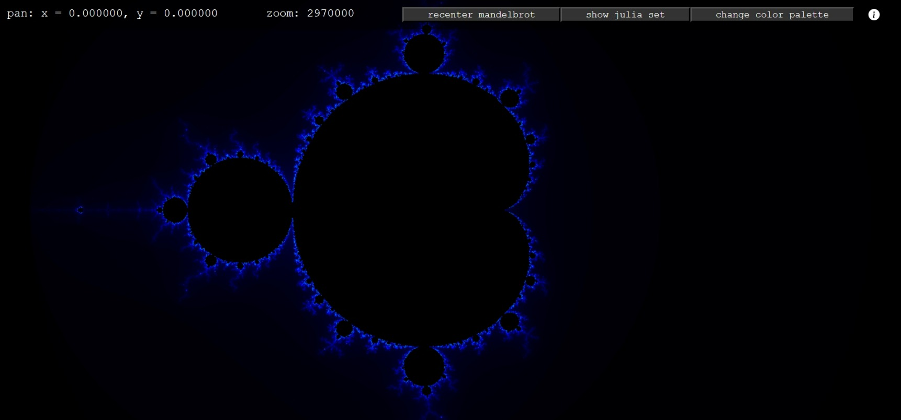
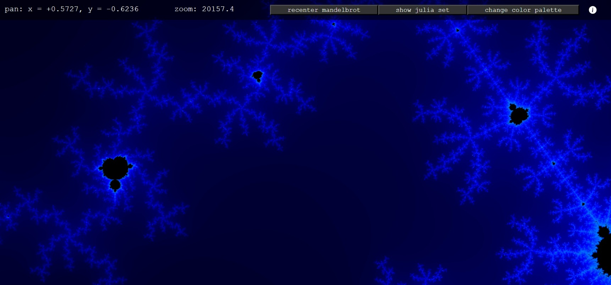
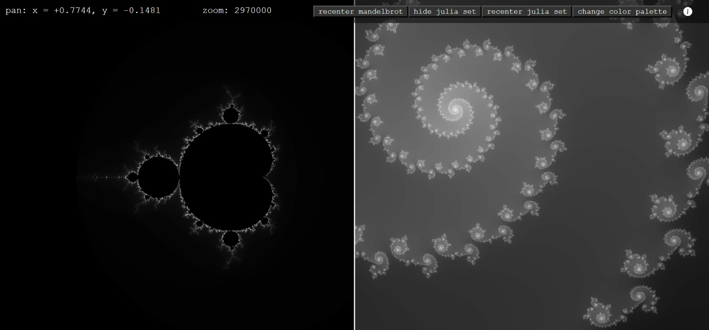

# mandelbrot
a fast and simple mandelbrot set explorer, made using WebGL!
[Demo link: https://minimal-mandelbrot.vercel.app/](https://minimal-mandelbrot.vercel.app/)

## controls
zoom - `scroll (mouse / touchpad)`
pan - `drag`

## features
- you can explore the Mandelbrot set! 
- you can also explore the Julia set associated with any point on the Mandelbrot set!
- you can change colors! now that's what I call cool!

## but what is the mandelbrot set?
In extremely oversimplified and not entirely accurate terms, a fractal is a shape that you can zoom into, and find a smaller copy of that very shape! This means that theoretically, you can "zoom into fractals forever". The Mandelbrot set is one example fractal. It lives on the complex plane. This is how it is constructed:

1) take any point $c$ on the complex plane.
2) let $z_0=0$.
3) now, square $z_0$ and add $c$ to it. call this new number $z_1$.
4) similarly, $z_2 = z_1^2+c$, $z_3 = z_2^2+c$ and so on.
5) finally, as the integer $n$ approaches infinity, check if $z_n$ also diverges to infinity. if it does, the $c$ we chose is not in the Mandelbrot set. if it stays bounded, however, $c$ *is* in the mandelbrot set!
6) repeat for all complex numbers $c$.

in this program, you're seeing a visualisation of the Mandelbrot set on the complex plane. if a complex number (point) is in the Mandelbrot set, it is left black. if it isn't, however, it is coloured based on how long it took to blow up to infinity.

similarly, the Julia sets shown are constructed by taking a specific constant $c$*, and taking $z_0$ as any point on the complex plane. then, the $z^2+c$ procedure is repeated, and we check if $z$ blows up to infinity. however, the key difference is $c$ is a constant value picked by the user, and $z$ taken for all points on the complex plane, and colored based on how long it takes to diverge.
(Note: I've coloured the inside of the Julia set blue, whenever it does have an inside.)

**the c we take is the point on the complex plane that the little white dot you can see sitting in the middle of the part of the page that displays the Mandelbrot set, is sitting on.*

## why i made this
i wanted an excuse to learn basic WebGL, and mandelbrots are cool! **:<zero-width space>)**

## why it becomes pixelated when you zoom to far
I'm pretty sure this is because you've hit the limit of floating-point number precision. I'd love to know how to get around this, and make it possible to zoom in further!

## screenshots

